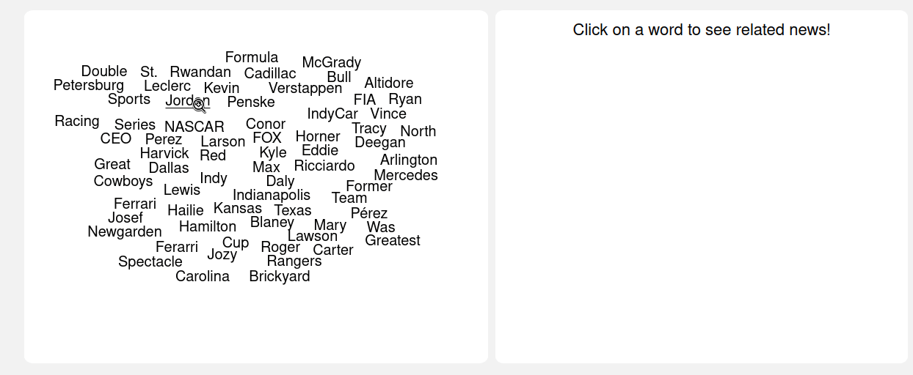

# FeedNimbus

FeedNimbus is a feed client that seeks to improve content exploration presenting feed items grouped not by source, but by subject. The main topics are extracted from all items, and shown in a wordcloud. Also, this content presentation has the aim to avoid the scrolling prevalent in most social media.



Simplicity is a concern here. The UI seeks to be minimalist and no frameworks are used.

## Installing

1. Clone the repo;

2. Install dependencies with pipenv

```bash
pipenv install```

3. Run

```bash
pipenv run python3 app.py```

4. Click on _Settings_ and set up your feedlist and, optionally, a list of stopwords;

5. Click on _Reload_ to get the wordcloud from your feeds.

